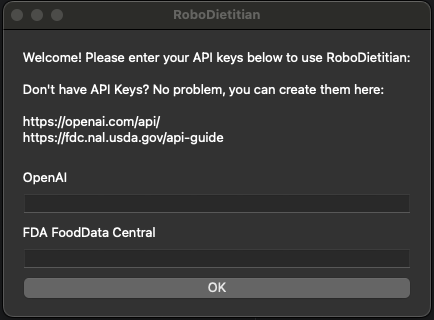
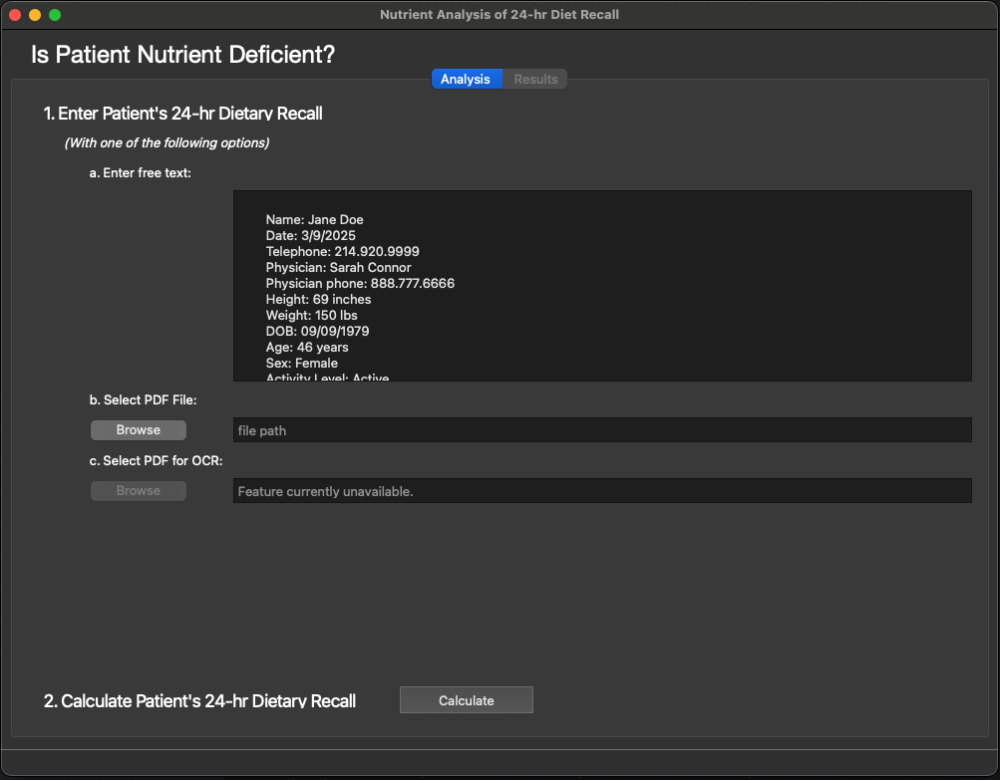
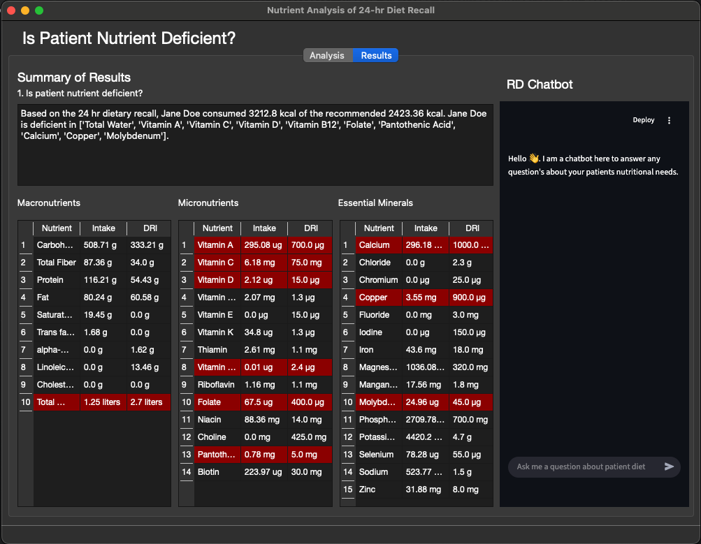

# RoboDietitian

## Hello! Welcome.

RoboDietitian is an experimental tool intended to assist Registered Dietitians (RDs)
perform nutrition assessments on patients. More specifically, **RoboDietitian can find 
nutrient deficiencies in healthy patients.** RoboDietitian performs Nutrient Analysis of
a 24-hour Diet Recall using Large Langauge Models (LLMs) to accelerate the process.

This program was created for our SIADS 699 Capstone Project at the University of Michigan,
School of Information. (siads_699_capstone_nutrient_knights)

Developers for this project are:
1. Ayan Banerjee
2. Richard Chaulker 
3. Daniel Torrecampo
4. Wei Liu

**_Important Note:_** RoboDietitian should not be used for personal, medical, or health related applications.
This project is purely experimental and the results should be reviewed for accuracy.

## Why Should I use RoboDietitian?
RoboDietitian addresses two problems. 
1. Nutrient analysis of 24-hour Diet Recalls is slow and requires extensive manual inputs.
2. Options for itemizing food categories are limited.

RoboDietitian uses LLM technology and advanced search algorithms in attempt to accurately and rapidly perform nutrient analysis of 24-hour diet recalls.

## Requirements

To use RoboDietitan, you will need Python 3.12.

1. Install: **_Python 3.12.3_** https://www.python.org/downloads/release/python-3123/
2. In your terminal/command window, enter: **_pip install -r requirements.txt_**
3. API Key for _OpenAI_: https://openai.com/api
4. API Key for _FDA FoodData Central Database_ (Free): https://fdc.nal.usda.gov/api-guide

## How to use RoboDietitian

0. To start RoboDietitian, run _**main.py**_

1. Enter your API keys. 
   2. This is required to access FDA food databases and OpenAI's LLM.

2. Enter patient's 24-hour Diet Recall 
   3. You can enter 24-hour diet recall via plain text or pdf. Examples are provided in _example_diet_recalls_ directory
4. Click **_Calculate_**

3. Review Nutrient Analysis Results
   4. Nutrient deficiencies are highlighted in red.
   5. The RD Chatbot is availble to answer questions related to patients 24-hour diet recall.

